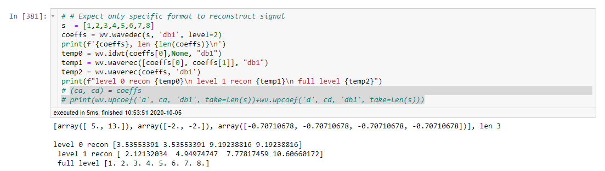

Voor de **Target**, het origineel signaal,  is er een wavelet decompositie gedaan laten we zeggen tot level 11.
Een nieuwe **Y** is reconstrueerd hieruit door telkens een level niet mee te nemen bij de reconstructie.
Voorbeeld: 
**Y = A1+...+ A10** reconstructie dus level 11 is  niet meer inbegrepen. 

*Uitdaging*:

Elk level die niet meegenomen wordt kan niet tot het origineel signaal ge-reconstruuerd worden zonder meer interpolatie toevoegen. Zie voorbeeld:

*Oplossing*:

Dus om **X** te krijgen doen we dus **Target-Y = Rest** , de **Rest** wordt onze **X**. Dit betekent dat we als het goed is het signaal hebben dat niet mee is genomen met de reconstructie. 

We creeëren dus uit *Y, X* een **Y'** , namelijk : $$Y' = Y + \gamma X,$$ dus *Y' en X* gebruiken we in PCMCI. 

Dus met andere woorden voor elk level dat niet mee wordt genomen in de reconstructie doen we de bovenstaande procedure en verzamelen we de **MCI** coëfficienten tussen *Y' en X*. 

Wat opvalt is dat een MCI peak zit tussen level **2-4** want de bovenstaande procedure beginnen we met level **11 t/m 1**. 